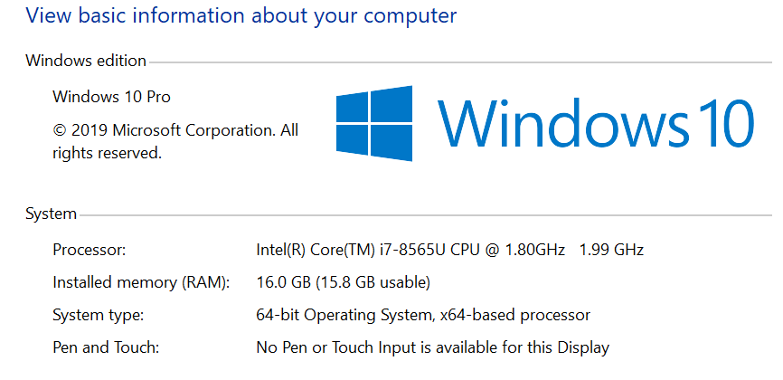
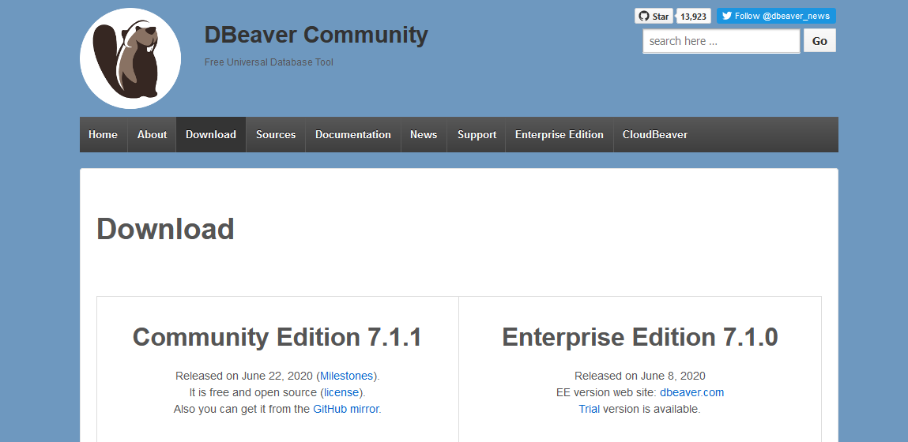
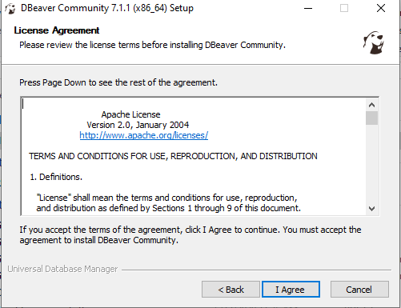

# Environment Setup Guide
---

## Purpose

> This document provides a list of the required technologies for this program. It details why each technology is required and provides some step-by-step instructions on how to install and configure the technologies. This guide also walks you through any needed environment setup.

**NOTE**: It is VERY important that you install these technologies before training begins as we will not have much time to devote to environment setup due to the volume of content we'll cover. It is also important that you install the correct versions of the tools listed here as not all versions of the technologies we will use are guaranteed to be compatible with each other. If you choose to use a different version of one of the tools listed here, you will be responsible for debugging issues that are specific to your version.

## Required Technologies

The following technologies are required in order to complete this phase of the program:

- **Eclipse**: We will be using Eclipse as our *integrated development environment* (IDE). Though you don't need an IDE to write code, an IDE provides several features that make rapid development (e.g. quickly writing and refactoring code) easier.
- **DBeaver**: DBeaver is a free, open source universal database tool that is compatible with several external data sources, PostgreSQL included. We'll use DBeaver in order to modify our databases and persist data using a simple user interface provided to us by the tool.
- **GitHub Desktop**: I will be using GitHub to host and share coding examples and notes (at least for the first half of the training). To install the examples locally onto your system, we will need to install GitHub Desktop.

## Installation Method

**NOTE**: This guide primarily is written for those on a Windows Machine. 

This method is compatible with all environments as it does not require any platform-specific package managers. You need only visit the official websites for each of the technologies listed and download the version of the tool that is compatible with your system.

Do note, however, that setting system environment variables differs from machine to machine. This guide shows how to set environment variables on a Windows machine.

The first thing you'll want to do is open your web browser of choice. This guide will use *Chrome*.

**Note**: Many of the tools that you will install have different system installers that are platform dependent. It is **very** important that you download the correct installer. The following list details how you should choose the installer for a program:

- If you have a 32-bit version of Windows, use the installer that is marked as the 32-bit version.
- If you have a 64-bit version of Windows, use the installer that is marked as the 64-bit version.
- If you have a Linux distribution (e.g. Debian, Ubuntu, Red Hat, Fedora), you should choose the installer that matches your distribution.
- If you have a Mac, you should choose the installer that is marked as the Mac installer.

These options will be clearly labeled on the websites you visit to download the technologies. If you're not sure how to figure out what version of the Windows operating system you're running, do the following:

1. Type "Control Panel" into the Windows search bar and click on the "Control Panel" app.
2. Select "System and Security".
3. Select "System".

You should now see the following screen:

You should see your operating system listed ("Windows 10" in the above example) and the system type listed under the "System" tab (a 64-bit operating system in the above example).

### Step 1: Install Spring Tool Suite 4

Navigate to the [Eclipse Installer ](https://www.eclipse.org/downloads/packages/installer) website and follow the guide found on the webpage to download and install Eclipse. 

### Step 2: Install DBeaver

In order to install DBeaver, please visit [DBeaver's official website](https://dbeaver.io/download/).

Once you navigate to the website, you should see the following:

You'll notice that there are two options: Community Edition and Enterprise Edition. Please select the **Community Edition** as it is free. Do NOT select the Enterprise as it is not free.

You will find the installers for the Community Edition if you scroll down the page. They should be located directly beneath the the box which says "Community Edition 7.1.1". As with all other software listed here, please make sure that you choose the correct installer for your system.

Once you've clicked on the installer that is compatible with your system, you'll be prompted to save the file. Save it and note where you've saved it on your machine. These files are usually stored in your computer's "Downloads" folder by default.

Now navigate to the folder where the installer is stored. For this example, we've downloaded the file to the "Downloads" folder.

Double click the installer. Once you've done so, the installer will be launched. The installer should take you through the process of setting up DBeaver. You'll be asked, for instance, to select a language of choice and review license terms before you install the software.

When you arrive at the portion of the setup which is titled "Choose Components", please select "DBeaver Community" and "Associate .SQL files".

If your installation was successful, you should now be able to search for and find "DBeaver" using your computer's search bar.

### Step 3: Install GitHub Desktop

1. Sign up for a GitHub account (preferrably using your new Revature email) on [GitHub's official website](https://github.com/).

2. Next, install GitHub Desktop by navigating to [GitHub Desktop website](https://desktop.github.com/)

====================

*  **Java Docs** (The official API specification for Java 8): https://docs.oracle.com/javase/8/docs/api/

